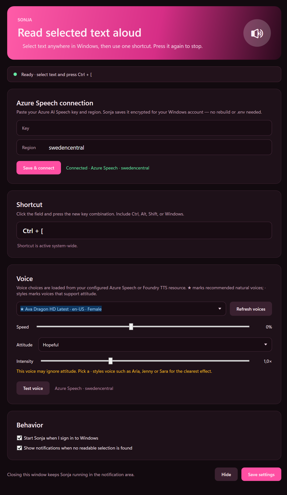

# Sonja Read Aloud

Read the text you've selected aloud in any Windows app with one keyboard shortcut. Press once to read, press again to stop. Sonja sits in the system tray and speaks with your own Azure AI Speech key.



## Features

- Reads the current selection anywhere, using UI Automation with a clipboard fallback.
- One global shortcut, fully configurable. The default is Ctrl + Alt + R.
- Attitude adds Azure neural speaking styles (friendly, cheerful, empathetic, excited, newsreader) with adjustable intensity, so it sounds natural instead of flat.
- Recommended natural voices (★) and style-capable voices (· styles) show up first.
- Adjustable voice and speed, plus optional start with Windows.
- Bring your own key. No accounts, no telemetry. You paste your Azure Speech key into the app and it's stored encrypted for your Windows account with DPAPI.

## Quick start

1. Get an Azure Speech key. You need your own Azure AI Speech resource; the app ships none.
   - Sign in with an [Azure account](https://azure.microsoft.com/free/). The free F0 Speech tier is plenty. No subscription? Create one, the free account includes credit.
   - Create the resource in the [Azure portal](https://portal.azure.com): pick Create a resource, search for Speech, then Create, and choose a subscription, resource group, and region. Open the resource and go to Keys and Endpoint.
   - Or use [Speech Studio](https://speech.microsoft.com). Sign in and it can create or select a Speech resource for you, then show the key under Keys and Endpoint.
   - Copy Key 1 and the Region, for example `westeurope` or `eastus`.
2. Run Sonja. Grab a published build, or run from source with `dotnet run --project Sonja.ReadAloud.csproj`.
3. Connect. In the Azure Speech connection panel, paste your Key and Region (for example `westeurope`) and click Save & connect. Your key is saved encrypted, so there's no rebuild or `.env` to edit.
4. Click Refresh voices, pick a voice and an attitude, then Save settings.

> Prefer a file? Put `SPEECH_KEY` and `SPEECH_REGION` in a `.env` next to the executable instead (copy `.env.example`). A key entered in the app wins over the file.

> Sharing the repo? Everyone brings their own key; the repo ships none. Send the source or a published build, and each person enters their own key in the app or their own `.env`. Never commit `.env` (it's in `.gitignore`), and rotate a key if it ever leaks.

## Voices and attitude

Click Refresh voices to load every voice on your resource. Recommended natural voices appear first (★), and voices tagged · styles support attitude.

| Voice | Character | Styles |
| --- | --- | --- |
| `en-US-Ava:DragonHDLatestNeural` | Ultra-natural HD (default) | No |
| `en-US-AvaMultilingualNeural` | Natural, multilingual | No |
| `en-US-AriaNeural` | Versatile, widest style set | Yes |
| `en-US-JennyNeural` | Warm assistant | Yes |
| `en-US-SaraNeural` | Youthful and lively | Yes |
| `en-GB-SoniaNeural` | British English | Yes |

Pick an attitude such as Cheerful, Empathetic, or Newsreader, and set the intensity from 0.5 to 2.0 times. The DragonHD voices sound best plain and ignore styles, so reach for a · styles voice like Aria or Jenny when you want attitude.

## Trigger it from a mouse button

A multi-button mouse can fire the shortcut, so you can read a selection without touching the keyboard.

1. Open your mouse software, such as Logitech Options+, Razer Synapse, or Microsoft Mouse and Keyboard Center.
2. Select a spare button and assign a keystroke or hotkey.
3. Record Sonja's shortcut (the default is Ctrl + Alt + R) and save.

No vendor software? Map a button to the keys with [AutoHotkey](https://www.autohotkey.com/). That button now reads or stops the selection.

## Build and publish

```powershell
dotnet build Sonja.slnx -c Release                                # build
dotnet test                                                       # run tests
dotnet publish Sonja.ReadAloud.csproj /p:PublishProfile=Win-x64   # self-contained win-x64
```

The published app lands at `artifacts/publish/win-x64/Sonja.ReadAloud.exe`. Keep a private `.env` beside it if you use one.

## Notes

- Selection capture uses UI Automation and falls back to a brief Ctrl + C, then restores your clipboard. Reading from an elevated window needs Sonja running at the same elevation.
- Other providers work too if you configure them instead of Azure Speech: ElevenLabs (`ELEVENLABS_API_KEY`) or Azure OpenAI TTS (`AZURE_OPENAI_TTS_*`).
- Theme colors live in [`App.xaml`](App.xaml). Replace [`Assets/sonja.ico`](Assets/sonja.ico) to change the icon.

## License

[MIT](LICENSE). The icon is the cherry blossom from [Twemoji](https://github.com/jdecked/twemoji), licensed CC-BY 4.0.

